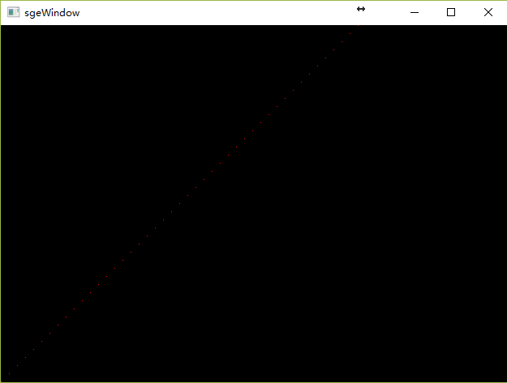

# 第2章：画布

> 我们把应用程序的窗口想象成一块画布，通过程序控制画布上的每个像素的颜色从而让窗口显示出丰富的图像。

-------------------
## Win32平台上窗口的建立

> 我们将窗口相关处理封装到一个名叫sgeApp的类里

- 注册窗口类
``` c++
static bool registerWinClass()
{
    static bool isRegistered = false;
    if (isRegistered) return true;
    WNDCLASSEX  wnd;
    memset(&wnd, 0, sizeof(wnd));
    wnd.cbSize = sizeof(wnd);
    wnd.lpfnWndProc = winAppWndProc;
    wnd.hbrBackground = (HBRUSH)GetStockObject(GRAY_BRUSH);
    wnd.hCursor = LoadCursor(0, IDC_ARROW);
    wnd.hIcon = 0;
    wnd.hIconSm = 0;
    wnd.hInstance = 0;
    wnd.lpszClassName = WNDCLASSNAME;
    wnd.style = CS_HREDRAW | CS_VREDRAW | CS_OWNDC;
    isRegistered = RegisterClassEx(&wnd) ? true : false;
    return isRegistered;
}
```

- 创建窗口
``` c++
HWND sgeApp::onCreateWND()
{
    HWND hWnd = CreateWindowEx(
        0
        , WNDCLASSNAME
        , WNDCLASSNAME
        , WS_OVERLAPPEDWINDOW
        , CW_USEDEFAULT
        , CW_USEDEFAULT
        , _width
        , _height
        , NULL
        , 0
        , 0
        , 0);
    return hWnd;
}
```

- 窗口消息处理函数
``` c++
sgeApp* sgeApp::instance = NULL;

static LRESULT CALLBACK winAppWndProc(HWND hWnd, UINT msgId, WPARAM wParam, LPARAM lParam)
{
    if (sgeApp::instance) // 分发到对应类的实现中去
        return sgeApp::instance->wndProc(hWnd, msgId, wParam, lParam);
    return DefWindowProc(hWnd, msgId, wParam, lParam);
}

LRESULT sgeApp::wndProc(HWND hWnd, UINT msgId, WPARAM wParam, LPARAM lParam)
{
    switch (msgId)
    {
    case WM_SIZE:
        _width = LOWORD(lParam);
        _height = HIWORD(lParam);
        onResize(_width, _height);
        break;
    case WM_CLOSE:
        DestroyWindow(hWnd);
        break;
    case WM_DESTROY:
        PostQuitMessage(0);
        return 0;
    }
    return DefWindowProc(hWnd, msgId, wParam, lParam);
}
```

- 消息循环
``` c++
    MSG     msg = { 0 };
    while (WM_QUIT != msg.message)
    {
        if (PeekMessage(&msg, 0, 0, 0, PM_REMOVE))
        {
            TranslateMessage(&msg);
            DispatchMessage(&msg);
        }
    }
    return 0;
```

## 实现画布类

> 我们把画布封装在一个Canvas的类中，我们分配了一片内存来保存画布的每个点的颜色信息
``` c++
    // sgeCanvas.h    
    class Canvas
    {
    public:
        Canvas(int width, int height);
        ~Canvas();

        int     width() { return _width; }
        int     height() { return _height; }
        void    resize(int w, int h);
        
        void    clear();
    private:
        int     dataSize() { return sizeof(color3f) * _width * _height; }
        color3f*            _pixels;
        int                 _width;
        int                 _height;
    };

    // sgeCanvas.cpp
    Canvas::Canvas(int width, int height)
    : _width(width), _height(height), _pixels(NULL)
    {
        assert(width > 0 && height > 0);
        _pixels = (color3f*)malloc(dataSize());
    }

    Canvas::~Canvas()
    {
        if (_pixels)
        {
            free(_pixels);
            _pixels = NULL;
        }
    }
    
    void sge::Canvas::resize(int w, int h)
    {
        _width = w;
        _height = h;
        _pixels = (color3f*)realloc(_pixels, dataSize());
    }
    
    void sge::Canvas::clear()
    {
        memset(_pixels, 0, dataSize());
    }
```

## 实现拷贝并显示画布数据到窗口
- 通过Win32API创建一个与窗口兼容的绘图DC，并创建一个32位无压缩的位图缓冲区与之绑定
``` c++
    _hDC = GetDC(_hWnd);
    _hMem = ::CreateCompatibleDC(_hDC);
    // ...
    BITMAPINFO	bmpInfor;
    bmpInfor.bmiHeader.biSize = sizeof(BITMAPINFOHEADER);
    bmpInfor.bmiHeader.biWidth = cw;
    bmpInfor.bmiHeader.biHeight = ch;
    bmpInfor.bmiHeader.biPlanes = 1;
    bmpInfor.bmiHeader.biBitCount = 32;
    bmpInfor.bmiHeader.biCompression = BI_RGB;
    bmpInfor.bmiHeader.biSizeImage = 0;
    bmpInfor.bmiHeader.biXPelsPerMeter = 0;
    bmpInfor.bmiHeader.biYPelsPerMeter = 0;
    bmpInfor.bmiHeader.biClrUsed = 0;
    bmpInfor.bmiHeader.biClrImportant = 0;
    _surface = CreateDIBSection(_hDC, &bmpInfor, DIB_RGB_COLORS, (void**)&_buffer, 0, 0);
    SelectObject(_hMem, _surface);
```

- 拷贝画布信息到位图缓冲区
``` c++
void sge::Canvas::writeToBitmap(void* buffer,int width, int height, int startX, int startY)
{
    typedef struct _tagRGBQUAD // BITMAP的颜色结构
    {
        byte  rgbBlue;
        byte  rgbGreen;
        byte  rgbRed;
        byte  rgbReserved;
    } RGBQUAD;

    RGBQUAD* pBuff = (RGBQUAD*)buffer; 
    for (int y = startY; y < height; ++y)
    {
        int dstdp = y * width;
        int srcdp = y * _width;
        for (int x = startX; x < width; ++x)
        {
            RGBQUAD& dst = pBuff[dstdp + x];
            Color3f& src = _pixels[srcdp + x];
            dst.rgbBlue = roundf(src._blue * 255.0f);
            dst.rgbGreen = roundf(src._green * 255.0f);
            dst.rgbRed = roundf(src._red * 255.0f);
            dst.rgbReserved = 0;
        }
    }
}
```

- 通过将兼容的DC的内容复制到窗口DC中，完成图形的显示
``` c++
BitBlt(_hDC, 0, 0, _canvas->width(), _canvas->height(), _hMem, 0, 0, SRCCOPY);
```

## 实现画点

- 画点的时候我们将画布上原本于绘制颜色进行混合得出最终颜色

``` c++
void sge::Canvas::drawPoint(int x, int y, color4f& color)
{
    if (x < 0 || x >= _width || y < 0 || y >= _height) return;
    Color3f & bkcolor = _pixels[y * _width + x];
    bkcolor = alphaBlend(bkcolor, color);
}
// sgeMath.h
inline Color3f alphaBlend(Color3f &bgcolor, Color4f &fcolor)
{
    float pA = 1.0f - fcolor._alpha;
    Color3f out;
    out._red = pA * bgcolor._red + fcolor._alpha * fcolor._red;
    out._green = pA * bgcolor._green + fcolor._alpha * fcolor._green;
    out._blue = pA * bgcolor._blue + fcolor._alpha * fcolor._blue;
    return out;
}
```

### 本节代码效果图


-------------------
### github链接https://github.com/xiangwencheng1994/sge/tree/master/lesson2.Canvas