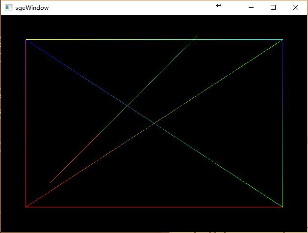

# 第2章：画线

> 目前计算机的图像的都是用像素表示的，无论是点、直线、圆或其他图形最终都会以点的形式显示。像素密度越大，图形看起来越细腻。

-------------------
## 像素点计算

### DDA算法

> https://baike.baidu.com/item/DDA%E7%AE%97%E6%B3%95/3896255?fr=aladdin
>
> 采用浮点步进，小数部分四舍五入转化为整数像素坐标

### Bresenham算法

> https://baike.baidu.com/item/bresenham%E7%AE%97%E6%B3%95/6430161?fr=aladdin
>
> 最长距离方向采用整数步进，另一方向根据误差判断是否跟进，相比上DDA算法少了大量浮点运算，还有一些系列基于该算法的部分优化版
> - 本节采用该算法进行画线
``` c++
void sge::Canvas::drawLine(int x1, int y1, int x2, int y2, const color4f & c1)
{
    int x, y, dx, dy, s1, s2, p, temp, interchange, i;
    x = x1;
    y = y1;
    dx = abs(x2 - x1);
    dy = abs(y2 - y1);

    if (x2 > x1)
        s1 = 1;
    else
        s1 = -1;

    if (y2 > y1)
        s2 = 1;
    else
        s2 = -1;

    if (dy > dx)
    {
        temp = dx;
        dx = dy;
        dy = temp;
        interchange = 1;
    }
    else
        interchange = 0;

    p = 2 * dy - dx;
    int pIndexMax = _width * _height;
    for (i = 1; i <= dx; i++)
    {
        drawPoint(x, y, c1);
        if (p >= 0)
        {
            if (interchange == 0)
                y = y + s2;
            else
                x = x + s1;
            p = p - 2 * dx;
        }
        if (interchange == 0)
            x = x + s1;
        else
            y = y + s2;
        p = p + 2 * dy;
    }
}
```
-------------------

## 颜色的线性渐变
> 颜色的渐变即个分量的渐变，使用线性插值即可
- 画渐变线段
``` c++
void sge::Canvas::drawLine(int x1, int y1, int x2, int y2, const color4f & c1, const color4f & c2)
{
    int x, y, dx, dy, s1, s2, p, temp, interchange, i;
    Color4f stepColor = c2 - c1;
    Color4f color = c1;
    x = x1;
    y = y1;
    dx = abs(x2 - x1);
    dy = abs(y2 - y1);
    
    if (x2 > x1)
        s1 = 1;
    else
        s1 = -1;

    if (y2 > y1)
        s2 = 1;
    else
        s2 = -1;

    if (dy > dx)
    {
        temp = dx;
        dx = dy;
        dy = temp;
        interchange = 1;
    }
    else
    {
        interchange = 0;
    }

    p = 2 * dy - dx;
    stepColor /= (float)dx;
    for (i = 1; i <= dx; i++)
    {
        drawPoint(x, y, color);
        if (p >= 0)
        {
            if (interchange == 0)
                y = y + s2;
            else
                x = x + s1;
            p = p - 2 * dx;
        }
        if (interchange == 0)
            x = x + s1;
        else
            y = y + s2;
        p = p + 2 * dy;

        color += stepColor;
    }
}
```

-------

### 本节代码效果图


-------------------
### github链接https://github.com/xiangwencheng1994/sge/tree/master/lesson3.Line