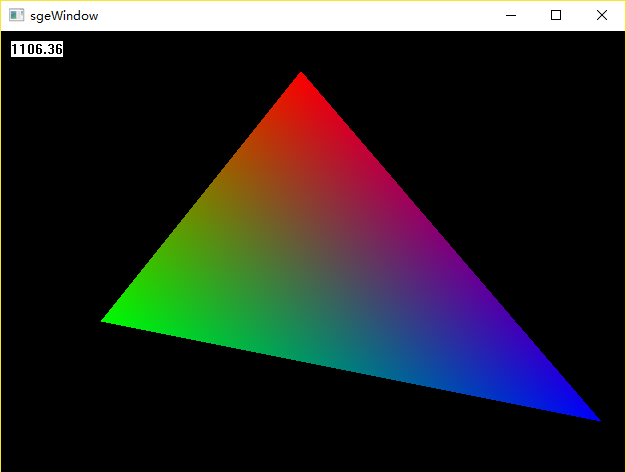

# 第4章：画三角形

> 三角形是最基本的图元之一，正方形由两个三角形构成，所有的多边形都能够分割成若干三角形（曲边可通过无限细分模拟），事实上在OpenGL和DirectX中，所有的形状都是通过绘制三角形来完成的。

-------------------
## 三角形填充算法

### 扫描线算法

> 将三角线分成一个平底三角形(下面两个顶点的Y坐标相同)和一个平顶三角形(上面两个顶点的Y坐标相同)，在按y扫描这两个三角形，一行一行的进行绘制

- 分成两个三角形，我们按y将三个点进行排序，不难将三角线分成上下两个三角形
``` c++
void sge::Canvas::drawTriangle(const Point & p1, const Point & p2, const Point & p3, const color4b & c1)
{
    Point p[3] = { p1, p2, p3 };
    // sort by y
    if (p[1].y > p[0].y) Swap(p[0], p[1]);
    if (p[2].y > p[0].y) Swap(p[0], p[2]);
    if (p[1].y < p[2].y) Swap(p[1], p[2]);

    int px = (int)roundf(float(p[1].y - p[0].y) / (p[2].y - p[0].y) * (p[2].x - p[0].x) + p[0].x);
    Point mid(px, p[1].y);

    drawFlatBottomTriangle(p[0], p[1], mid, c1);
    drawFlatTopTriangle(p[2], p[1], mid, c1);
}
```

- 绘制平底三角形，y递减，x步进

``` c++
void sge::Canvas::drawFlatBottomTriangle(const Point& top, const Point& left, const Point& right, const color4b& c1)
{
    float dy = top.y - left.y;
    float stepX1 = (top.x - left.x) / dy;
    float stepX2 = (top.x - right.x) / dy;
    float leftX = top.x;
    float rightX = top.x;
    for (int y = top.y; y >= left.y; --y)
    {
        if (rightX > leftX) drawSpanLine((int)leftX, (int)rightX, y, c1);
        else drawSpanLine((int)rightX, (int)leftX, y, c1);
        leftX -= stepX1;
        rightX -= stepX2;
    }
}
void sge::Canvas::drawSpanLine(int minX, int maxX, int y, const color4b & c1)
{
    if (y < 0 || y >= _height) return;
    if (maxX >= _width) maxX = _width - 1;
    
    for (int x = minX < 0 ? 0 : minX; x <= maxX; ++x)
    {
        maskBlend(_pixels[y * _width + x], c1);
    }
}
```

- 同理，绘制平顶三角线，y递增，x步进

``` c++
void sge::Canvas::drawFlatBottomTriangle(const Point& top, const Point& left, const Point& right, const color4b& c1)
{
    float dy = top.y - left.y;
    float stepX1 = (top.x - left.x) / dy;
    float stepX2 = (top.x - right.x) / dy;
    float leftX = top.x;
    float rightX = top.x;
    for (int y = top.y; y >= left.y; --y)
    {
        if (rightX > leftX) drawSpanLine((int)leftX, (int)rightX, y, c1);
        else drawSpanLine((int)rightX, (int)leftX, y, c1);
        leftX -= stepX1;
        rightX -= stepX2;
    }
}
```

### 重心坐标算法

> 三角形所在平面的任意点都能表示为顶点的加权平均值，这个权就叫做重心坐标。
> 
> 重心坐标可以通过求面积的占比进行计算，设P点在三角形ABC中的重心坐标为P(x, y, z),那么x则等于三角形PBC的面积除以三角形ABC的面积，y则等于三角形PAC的面积除以三角形ABC的面积，z则等于三角形PAB的面积除以三角形ABC的面积。
> 通过画图很好理解，x + y + z 始终为1，当他们都同时都在0到1之间时，则P点在三角形内部，反之则在三角形外部。
> 
> 我们可以通过扫描三角线的轴对齐包围盒内的每个像素进行判断是否在三角形内部，从而进行绘制。
> 通过比较和测试，该效率上比扫描线算法底，但可以更减小颜色插值的误差

## 渐变三角形

> 通过三个顶点的不同颜色，我们可以根据画渐变线一样进行线性插值，画出渐变的三角线。

### 本节代码效果图



- 由于采用软件计算，使用Release并调整编译选项，可显著提高帧率

-------------------
### github链接https://github.com/xiangwencheng1994/sge/tree/master/lesson4.Triangle